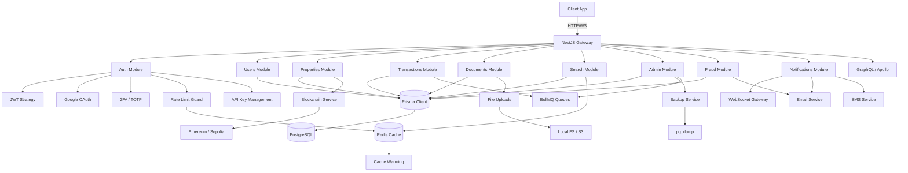
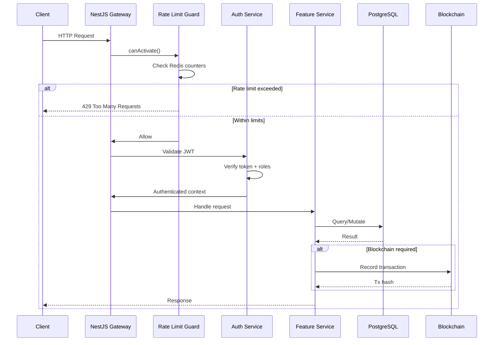

# Architecture Diagram

## Request Flow

## Module Relationships

| Module | Depends On | Provides |
|--------|-----------|----------|
| Auth | Users, JWT, Redis | Authentication, 2FA, API keys |
| Users | Prisma | User CRUD, profiles |
| Properties | Prisma, Blockchain, Geocoding | Property listings, images |
| Transactions | Prisma, Blockchain | Transaction lifecycle |
| Documents | Prisma, Uploads | Document management, signing |
| Search | Prisma, Redis | Full-text search, facets, autocomplete |
| Fraud | Prisma, Email | Fraud detection, alerts, auto-block |
| Admin | Prisma, Backup, BullMQ | Admin ops, backups, reports |
| Notifications | WebSocket, Email, SMS | Real-time + async notifications |
